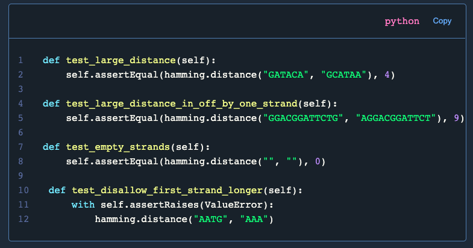

# Light Blue & White

This is the code highlight theme that is being used on [fabiorosado.dev](https://fabiorosado.dev), it's pretty minimal and the code highlight is mostly all white with some other colours like cyan, yellow and green.

## Installation Guide

This theme will work with the code block as shown on this post - [Add code highlighting to mdx](https://fabiorosado.dev/blog/add-code-highlighting-to-mdx). You might need to update the `scss` file if you are using a different code block.

1. Get the code from [code-highlight](code-highlight.scss) or clone this repository
2. Add file to your site
3. import the file from your main `scss` file
